<!--
 * @Author: Wginit
 * @Date: 2019-09-26 10:19:25
 * @LastEditTime: 2019-09-26 11:19:19
 -->
# css 开发技巧

## Layout Skill：布局技巧

#### 使用vw定制rem自适应布局

要点：移动端使用rem布局需要通过JS设置不同屏幕宽高比的font-size，结合vw单位和calc()可脱离JS的控制

```css
/* 基于UI width=750px DPR=2的页面 */
html {
    font-size: calc(100vw / 7.5);
}
```

#### 使用writing-mode排版竖文

 通过writing-mode调整文本排版方向

 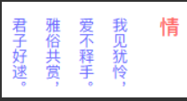

 #### 使用text-align-last对齐两端文本

 通过text-align-last:justify设置文本两端对齐

 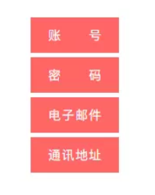

 #### 使用object-fit规定图像尺寸

通过object-fit使图像脱离background-size的约束，使用来标记图像背景尺寸

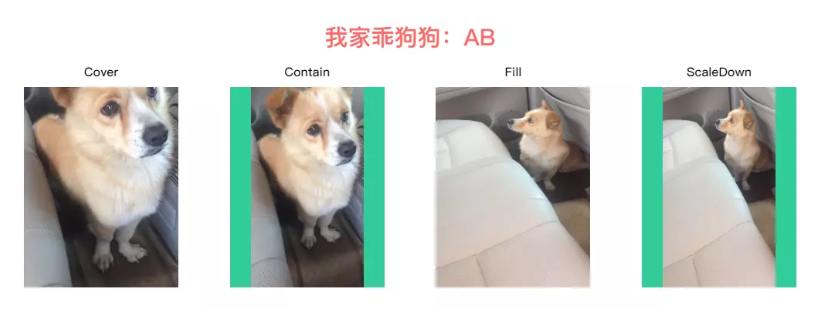

#### 使用letter-spacing排版倒序文本
通过letter-spacing设置负值字体间距将文本倒序

```css

.reverse-text {
	font-weight: bold;
	font-size: 50px;
	color: $red;
	letter-spacing: -100px; // letter-spacing最少是font-size的2倍
}

```


#### 使用margin-left排版左重右轻列表
使用flexbox横向布局时，最后一个元素通过margin-left:auto实现向右对齐
```css
<div class="bruce flex-ct-x">
	<ul class="left-list">
		<li>Alibaba</li>
		<li>Tencent</li>
		<li>Baidu</li>
		<li>Jingdong</li>
		<li>Ant</li>
		<li>Netease</li>
	</ul>
</div>

.left-list {
	display: flex;
	align-items: center;
	padding: 0 10px;
	width: 600px;
	height: 60px;
	background-color: $green;
	li {
		padding: 0 10px;
		height: 40px;
		background-color: $orange;
		line-height: 40px;
		font-size: 16px;
		color: #fff;
		& + li {
			margin-left: 10px;
		}
		&:last-child {
			margin-left: auto;
		}
	}
}
```


## Behavior Skill：行为技巧

#### 使用overflow-scrolling支持弹性滚动

iOS页面非body元素的滚动操作会非常卡(Android不会出现此情况)，通过overflow-scrolling:touch调用Safari原生滚动来支持弹性滚动，增加页面滚动的流畅度

```css
body {
    -webkit-overflow-scrolling: touch;
}
.elem {
    overflow: auto;
}
```
#### 使用transform启动GPU硬件加速
有时执行动画可能会导致页面卡顿，可在特定元素中使用硬件加速来避免这个问题
```css
.elem {
    transform: translate3d(0, 0, 0); /* translateZ(0)亦可 */
}
```

#### 使用:valid和:invalid校验表单
<input>使用伪类:valid和:invalid配合pattern校验表单输入的内容
```css
<div class="bruce flex-ct-x">
	<form class="form-validation">
		<div>
			<label>名字</label>
			<input type="text" placeholder="请输入你的名字(1到10个中文)" pattern="^[\u4e00-\u9fa5]{1,10}$" required>
		</div>
		<div>
			<label>手机</label>
			<input type="text" placeholder="请输入你的手机" pattern="^1[3456789]\d{9}$" required>
		</div>
		<div>
			<label>简介</label>
			<textarea required></textarea>
		</div>
	</form>
</div>

.form-validation {
	width: 500px;
	div {
		margin-top: 10px;
		&:first-child {
			margin-top: 0;
		}
	}
	label {
		display: block;
		padding-bottom: 5px;
		font-weight: bold;
		font-size: 16px;
	}
	input,
	textarea {
		display: block;
		padding: 0 20px;
		outline: none;
		border: 1px solid #ccc;
		width: 100%;
		height: 40px;
		caret-color: $blue;
		transition: all 300ms;
		&:valid {
			border-color: $green;
			box-shadow: inset 5px 0 0 $green;
		}
		&:invalid {
			border-color: $red;
			box-shadow: inset 5px 0 0 $red;
		}
	}
	textarea {
		height: 122px;
		resize: none;
		line-height: 30px;
		font-size: 16px;
	}
}

```
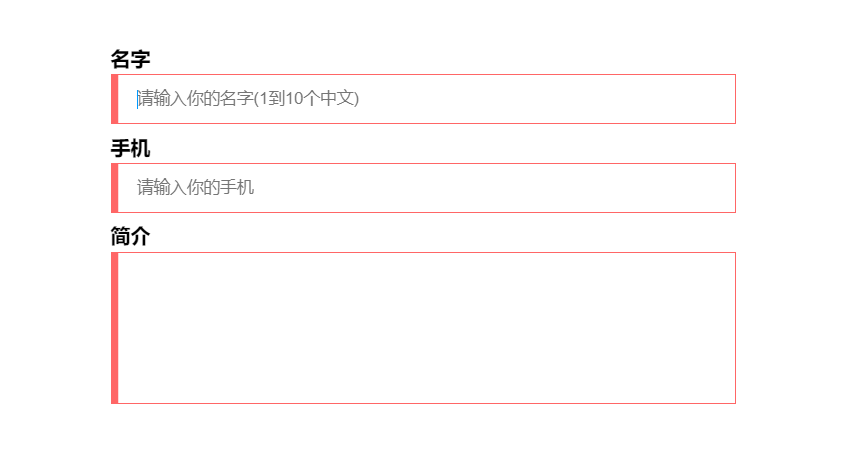

#### 使用resize拉伸分栏

通过resize设置横向自由拉伸来调整目标元素的宽度

```css
<div class="bruce flex-ct-x">
	<div class="stretching-column">
		<div class="left">
			<div class="resize-bar"></div>
			<div class="resize-line"></div>
			<div class="resize-text">ABCDEFGHIJKLMNOPQRSTUVWXYZ</div>
		</div>
		<div class="right">ABCDEFGHIJKLMNOPQRSTUVWXYZ</div>
	</div>
</div>

.stretching-column {
	overflow: hidden;
	border: 1px solid $blue;
	width: 600px;
	height: 300px;
	line-height: 20px;
	font-size: 16px;
	color: $orange;
	.left {
		overflow: hidden;
		float: left;
		position: relative;
		height: 100%;
	}
	.right {
		overflow: hidden;
		padding: 10px;
		height: 100%;
		background-color: #f0f0f0;
		word-break: break-all;
	}
}
.resize-bar {
	overflow: scroll;
	width: 200px;
	height: 100%;
	opacity: 0;
	resize: horizontal;
	&::-webkit-scrollbar {
		width: 200px;
		height: 100%;
	}
	&:hover,
	&:active {
		& ~ .resize-line {
			border-left: 1px dashed $blue;
		}
	}
}
.resize-line {
	position: absolute;
	right: 0;
	top: 0;
	bottom: 0;
	border-left: 1px solid #ccc;
	border-right: 2px solid #f0f0f0;
	pointer-events: none;
}
.resize-text {
	overflow-x: hidden;
	position: absolute;
	left: 0;
	right: 5px;
	top: 0;
	bottom: 0;
	padding: 10px;
	word-break: break-all;
}
```

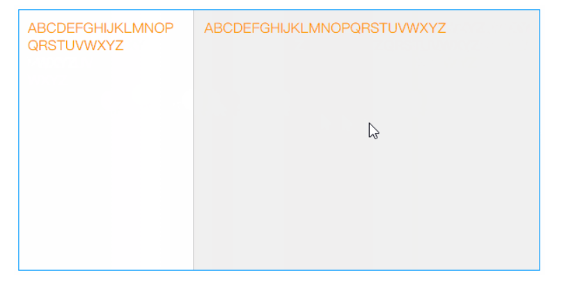

## Color Skill：色彩技巧

#### 使用color改变边框颜色
border没有定义border-color时，设置color后，border-color会被定义成color
```css
.elem {
    border: 1px solid;
    color: #f66;
}
```

#### 使用filter开启悼念模式
通过filter:grayscale()设置灰度模式来悼念某位去世的仁兄或悼念因灾难而去世的人们
```css
<div class="bruce flex-ct-x">
	<div class="mourning-mode">
		
	</div>
</div>

html {
	filter: grayscale(100%);
}
.mourning-mode {
	img {
		width: 400px;
	}
}
```

#### 使用::selection改变文本选择颜色
通过::selection根据主题颜色自定义文本选择颜色

```css
<div class="bruce flex-ct-x">
	<div class="select-color">
		<p>全局选择文字颜色</p>
		<p>全局选择文字颜色</p>
		<p class="special">局部选择文字颜色</p>
	</div>
</div>
::selection {
	background-color: $purple;
	color: #fff;
}
.select-color {
	line-height: 50px;
	font-weight: bold;
	font-size: 30px;
	color: $red;
}
.special::selection {
	background-color: $green;
}
```
#### 使用linear-gradient控制背景渐变
通过linear-gradient设置背景渐变色并放大背景尺寸，添加背景移动效果
```css
<div class="bruce">
	<div class="gradient-bg">iCSS</div>
</div>
.gradient-bg {
	display: flex;
	justify-content: center;
	align-items: center;
	height: 100%;
	background: linear-gradient(135deg, $red, $orange, $green, $blue, $purple) left center/400% 400%;
	font-weight: bold;
	font-size: 100px;
	color: #fff;
	animation: move 10s infinite;
}
@keyframes move {
	0%,
	100% {
		background-position-x: left;
	}
	50% {
		background-position-x: right;
	}
}
```
#### 使用linear-gradient控制文本渐变

通过linear-gradient设置背景渐变色，配合background-clip:text对背景进行文本裁剪，添加滤镜动画
```css
<div class="bruce flex-ct-x">
	<h1 class="gradient-text">Full Stack Developer</h1>
</div>
.gradient-text {
	background-image: linear-gradient(90deg, $red, $orange);
	background-clip: text;
	line-height: 60px;
	font-size: 60px;
	animation: hue 5s linear infinite;
	-webkit-text-fill-color: transparent;
}
@keyframes hue {
	from {
		filter: hue-rotate(0);
	}
	to {
		filter: hue-rotate(-1turn);
	}
}
```

#### 使用caret-color改变光标颜色

通过caret-color根据主题颜色自定义光标颜色
```css
textarea {
		caret-color: $blue;
}
```

#### 使用:scrollbar改变滚动条样式
通过scrollbar的scrollbar-track和scrollbar-thumb等属性来自定义滚动条样式
```css
.scroll-indicator {
	position: relative;
	overflow: hidden;
	border: 1px solid $purple;
	width: 500px;
	height: 300px;
	&::after {
		position: absolute;
		left: 0;
		right: 5px;
		top: 2px;
		bottom: 0;
		background-color: #fff;
		content: "";
	}
}
.article {
	overflow: auto;
	height: 100%;
	&::-webkit-scrollbar {
		width: 5px;
	}
	&::-webkit-scrollbar-track {
		background-color: #f0f0f0;
	}
	&::-webkit-scrollbar-thumb {
		border-radius: 2px;
		background-color: $purple;
	}
	article {
		padding: 0 20px;
		background: linear-gradient(to right top, $red 50%, #f0f0f0 50%) no-repeat;
		background-size: 100% calc(100% - 298px + 5px);
		> * {
			position: relative;
			z-index: 9;
		}
	}
	h1 {
		line-height: 40px;
		text-align: center;
		font-weight: bold;
		font-size: 20px;
	}
	p {
		margin-top: 20px;
		line-height: 20px;
		text-indent: 2em;
	}
}
```
## Figure Skill：图形技巧
#### 使用div描绘各种图形
<div>配合其伪元素(::before、::after)通过clip、transform等方式绘制各种图形

#### 使用mask雕刻镂空背景
```css
<div class="bruce pr flex-ct-x">
	<div class="mask-layer"></div>
</div>
$mask-bg: "https://yangzw.vip/static/codepen/mask-bg.jpg";
$mask-text: "https://yangzw.vip/static/codepen/mask-text.jpg";
$logo: "https://yangzw.vip/static/codepen/logo-netease.svg";

.bruce {
	overflow: hidden;
	&::after {
		position: absolute;
		left: -20px;
		right: -20px;
		top: -20px;
		bottom: -20px;
		background: url($mask-bg) no-repeat center/cover;
		filter: blur(10px);
		content: "";
	}
}
.mask-layer {
	position: relative;
	z-index: 9;
	width: 600px;
	height: 300px;
	background: url($mask-text) left center/150% auto;
	mask: url($logo) center/cover;
	animation: move 10s infinite;
}
@keyframes move {
	0% {
		background-position-x: 0;
	}
	50% {
		background-position-x: 100%;
	}
}
```
#### 使用linear-gradient描绘波浪线
通过linear-gradient绘制波浪线
```css
<div class="bruce flex-ct-x">
	<p class="waveline-text">波浪线文字</p>
</div>
@mixin waveline($h, $color: $red) {
	position: relative;
	&::after {
		position: absolute;
		left: 0;
		top: 100%;
		width: 100%;
		height: $h;
		background: linear-gradient(135deg, transparent, transparent 45%, $color, transparent 55%, transparent 100%), linear-gradient(45deg, transparent, transparent 45%, $color, transparent 55%, transparent 100%);
		background-size: $h * 2 $h * 2;
		content: "";
	}
}
.waveline-text {
	height: 20px;
	line-height: 20px;
	letter-spacing: 10px;
	@include waveline(10px);
}
```
#### 使用linear-gradient描绘彩带
通过linear-gradient绘制间断颜色的彩带
```css
<div class="bruce flex-ct-x">
	<div class="colour-bar"></div>
</div>
.colour-bar {
	width: 500px;
	height: 50px;
	background-image: repeating-linear-gradient(90deg, $red, $red 50px, $purple 50px, $purple 100px);
}
```
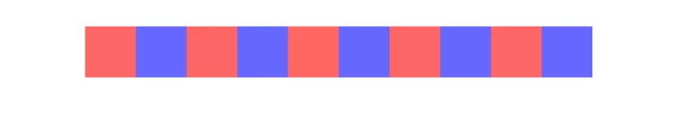

#### 使用conic-gradient描绘饼图
通过conic-gradient绘制多种色彩的饼图
```css
<div class="bruce flex-ct-x">
	<div class="pie-chart"></div>
</div>
.pie-chart {
	border-radius: 100%;
	width: 300px;
	height: 300px;
	background-image: conic-gradient($red 0 25%, $purple 25% 30%, $orange 30% 55%, $blue 55% 70%, $green 70% 100%);
}
```
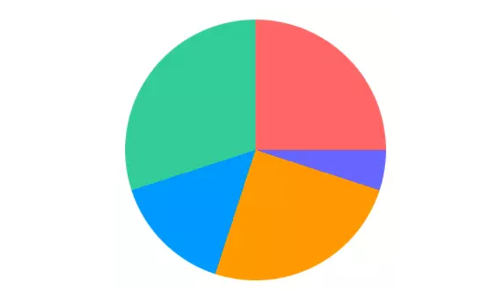

#### 使用linear-gradient描绘方格背景
使用linear-gradient绘制间断颜色的彩带进行交互生成方格
```css
<div class="bruce flex-ct-x">
	<div class="square-bg"></div>
</div>
.square-bg {
	width: 500px;
	height: 300px;
	background-image: linear-gradient(45deg, #eee 25%, transparent 25%, transparent 75%, #eee 75%),
		linear-gradient(45deg, #eee 25%, transparent 25%, transparent 75%, #eee 75%);
	background-position: 0 0, 20px 20px;
	background-size: 40px 40px;
}
```

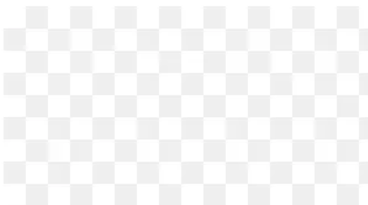

#### 使用box-shadow描绘单侧投影
通过box-shadow生成投影，且模糊半径和负的扩张半径一致，使投影偏向一侧
```css
<div class="bruce flex-ct-x">
	<div class="aside-shadow">投影</div>
</div>
.aside-shadow {
	display: flex;
	justify-content: center;
	align-items: center;
	border: 1px solid;
	width: 100px;
	height: 100px;
	box-shadow: -7px 0 5px -5px $orange;
	font-weight: bold;
	font-size: 30px;
	color: $orange;
}
```
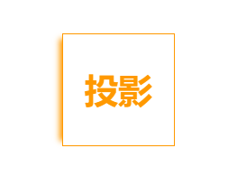

#### 使用filter描绘头像彩色阴影
通过filter:blur() brightness() opacity()模拟阴影效果
```css
<div class="bruce flex-ct-x">
	<div class="avatar-shadow"></div>
</div>
$avatar: "https://yangzw.vip/static/codepen/thor.jpg";

.avatar-shadow {
	position: relative;
	border-radius: 100%;
	width: 200px;
	height: 200px;
	background: url($avatar) no-repeat center/cover;
	&::after {
		position: absolute;
		left: 0;
		top: 10%;
		z-index: -1;
		border-radius: 100%;
		width: 100%;
		height: 100%;
		background: inherit;
		filter: blur(10px) brightness(80%) opacity(.8);
		content: "";
		transform: scale(.95);
	}
}
```
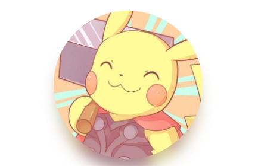

#### 使用box-shadow裁剪图像
通过box-shadow模拟蒙层实现中间镂空
```css
<div class="bruce flex-ct-x">
	<div class="img-cliper">
		
		<div class="mask">
			<i></i>
		</div>
	</div>
</div>
.img-cliper {
	overflow: hidden;
	position: relative;
	img {
		width: 400px;
	}
	i {
		position: absolute;
		left: 50px;
		top: 30px;
		border-radius: 100%;
		width: 100px;
		height: 50px;
		box-shadow: 0 0 0 9999px rgba(#000, .5);
	}
	.mask {
		position: absolute;
		left: 0;
		right: 0;
		top: 0;
		bottom: 0;
	}
}
```

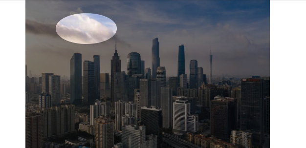

#### 使用outline描绘内边框

通过outline设置轮廓进行描边，可设置outline-offset设置内描边
```css
<div class="bruce flex-ct-x">
	<div class="outside-border"></div>
</div>
.outside-border {
	outline: 10px dashed $blue;
	outline-offset: -50px;
	border: 10px dashed $orange;
	width: 300px;
	height: 300px;
	background-color: $green;
}
```
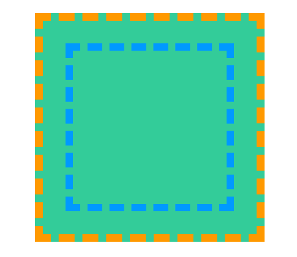

## Component Skill：组件技巧
#### 下划线跟随导航栏
下划线跟随鼠标移动的导航栏
```css
<div class="bruce flex-ct-x">
	<ul class="underline-navbar">
		<li>Alibaba阿里巴巴</li>
		<li>Tencent腾讯</li>
		<li>Baidu百度</li>
		<li>Jingdong京东</li>
		<li>Ant蚂蚁金服</li>
		<li>Netease网易</li>
	</ul>
</div>
.underline-navbar {
	display: flex;
	li {
		position: relative;
		padding: 10px;
		cursor: pointer;
		font-size: 20px;
		color: $blue;
		transition: all 300ms;
		&::before {
			position: absolute;
			left: 100%;
			top: 0;
			border-bottom: 2px solid transparent;
			width: 0;
			height: 100%;
			content: "";
			transition: all 300ms;
		}
		&:active {
			background-color: $blue;
			color: #fff;
		}
		&:hover {
			&::before {
				left: 0;
				top: 0;
				z-index: -1;
				border-bottom-color: $blue;
				width: 100%;
				transition-delay: 100ms;
			}
			& + li::before {
				left: 0;
			}
		}
	}
}
```
#### 故障文本
显示器故障形式的文本
```css
<div class="bruce flex-ct-x">
	<div class="fault-text" data-text="ERROR">ERROR</div>
</div>
.bruce {
	background-color: #000;
}
.fault-text {
	position: relative;
	font-weight: bold;
	font-size: 100px;
	color: #fff;
	&::before,
	&::after {
		overflow: hidden;
		position: absolute;
		top: 0;
		background-color: #000;
		clip: rect(0, 900px, 0, 0);
		color: #fff;
		content: attr(data-text);
		animation: shake 3s linear infinite alternate-reverse;
	}
	&::before {
		left: -2px;
		text-shadow: 1px 0 $blue;
	}
	&::after {
		left: 2px;
		text-shadow: -1px 0 $red;
		animation-duration: 2s;
	}
}
@keyframes shake {
	$steps: 20;
	@for $i from 0 through $steps {
		#{percentage($i * (1 / $steps))} {
			clip: rect(random(100) + px, 9999px, random(100) + px, 0);
		}
	}
}
```
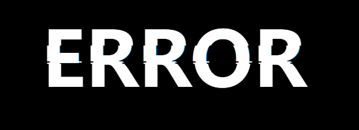

#### 状态悬浮球

展示当前状态的悬浮球
```css
<div class="bruce flex-ct-x">
	<div class="state-ball warning">
		<div class="wave"></div>
	</div>
</div>
.state-ball {
	overflow: hidden;
	position: relative;
	padding: 5px;
	border: 3px solid $green;
	border-radius: 100%;
	width: 150px;
	height: 150px;
	background-color: #fff;
	&::before,
	&::after {
		position: absolute;
		left: 50%;
		top: 0;
		z-index: 20;
		margin-left: -100px;
		width: 200px;
		height: 200px;
		content: "";
	}
	&::before {
		margin-top: -150px;
		border-radius: 45%;
		background-color: rgba(#fff, .5);
		animation: rotate 10s linear -5s infinite;
	}
	&::after {
		margin-top: -160px;
		border-radius: 40%;
		background-color: rgba(#fff, .8);
		animation: rotate 15s infinite;
	}
	&.warning {
		border-color: $orange;
		.wave {
			background-image: linear-gradient(-180deg, #f0c78a 13%, $orange 91%);
		}
	}
	&.danger {
		border-color: $red;
		.wave {
			background-image: linear-gradient(-180deg, #f78989 13%, $red 91%);
		}
	}
}
.wave {
	position: relative;
	border-radius: 100%;
	width: 100%;
	height: 100%;
	background-image: linear-gradient(-180deg, #af8 13%, $green 91%);
}
@keyframes rotate {
	from {
		transform: rotate(0);
	}
	to {
		transform: rotate(1turn);
	}
}
```
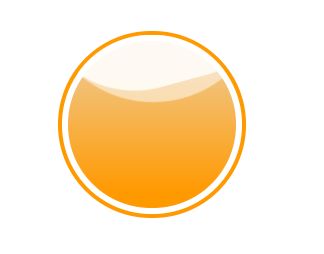

#### 粘粘球

相交粘粘效果的双球回弹运动
```css
<div class="bruce flex-ct-x">
	<div class="sticky-ball">
		<div class="ball-1"></div>
		<div class="ball-2"></div>
	</div>
</div>
.bruce {
	filter: contrast(10);
}
.sticky-ball {
	position: relative;
	width: 320px;
	height: 80px;
	filter: contrast(10);
}
div[class*=ball-] {
	position: absolute;
	top: 0;
	padding: 10px;
	border-radius: 100%;
	width: 80px;
	height: 80px;
	background-color: $red;
	filter: blur(5px);
	animation: 6s infinite;
}
.ball-1 {
	left: 0;
	animation-name: move-1 !important;
}
.ball-2 {
	left: 240px;
	animation-name: move-2 !important;
}
@keyframes move-1 {
	0%,
	20%,
	100% {
		width: 80px;
		height: 80px;
	}
	50% {
		left: 110px;
		top: -15px;
		width: 110px;
		height: 110px;
	}
	85% {
		left: 75px;
		width: 90px;
		height: 70px;
	}
	90% {
		top: -2px;
		width: 75px;
		height: 85px;
	}
}
@keyframes move-2 {
	0%,
	20%,
	100% {
		width: 80px;
		height: 80px;
	}
	50% {
		left: 110px;
		top: -15px;
		width: 110px;
		height: 110px;
	}
	85% {
		left: 165px;
		width: 90px;
		height: 70px;
	}
	90% {
		top: -2px;
		width: 75px;
		height: 85px;
	}
}
```


#### 商城票券

边缘带孔和中间折痕的票劵
```css
<div class="bruce flex-ct-x">
	<div class="mall-ticket">
		<h3>100元</h3>
		<p>网易考拉代金券</p>
	</div>
</div>
.mall-ticket {
	display: flex;
	position: relative;
	width: 300px;
	height: 100px;
	background: radial-gradient(circle at right top, transparent 10px, $red 0) top left/100px 51% no-repeat,
		radial-gradient(circle at right bottom, transparent 10px, $red 0) bottom left/100px 51% no-repeat,
		radial-gradient(circle at left top, transparent 10px, #ccc 0) top right/200px 51% no-repeat,
		radial-gradient(circle at left bottom, transparent 10px, #ccc 0) bottom right/200px 51% no-repeat;
	filter: drop-shadow(2px 2px 2px rgba(#fff, .2));
	line-height: 100px;
	text-align: center;
	color: #fff;
	&::before {
		position: absolute;
		left: 100px;
		top: 0;
		bottom: 0;
		margin: auto;
		border: 1px dashed $purple;
		height: 80px;
		content: "";
	}
	&::after {
		position: absolute;
		left: 100%;
		top: 0;
		width: 5px;
		height: 100%;
		background-image: linear-gradient(180deg, #ccc 5px, transparent 5px, transparent),
			radial-gradient(10px circle at 5px 10px, transparent 5px, #ccc 5px);
		background-size: 5px 15px;
		content: "";
	}
	h3 {
		width: 100px;
		font-size: 30px;
	}
	p {
		flex: 1;
		font-weight: bold;
		font-size: 18px;
	}
}
```
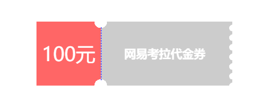

#### 三维立方体
三维建模的立方体
```css
<div class="bruce flex-ct-x">
	<div class="td-cube">
		<ul>
			<li class="front">1</li>
			<li class="back">2</li>
			<li class="top">3</li>
			<li class="bottom">4</li>
			<li class="left">5</li>
			<li class="right">6</li>
		</ul>
	</div>
</div>
$width: 150px;
$height: 150px;
$length: 150px;

.td-cube {
	width: $width;
	height: $height;
	perspective: 1000px;
	ul {
		position: relative;
		width: 100%;
		height: 100%;
		transform: rotateX(-15deg) rotateY(15deg);
		transform-style: preserve-3d;
		animation: rotate 5s infinite linear;
	}
	li {
		display: flex;
		position: absolute;
		justify-content: center;
		align-items: center;
		width: $width;
		height: $height;
		opacity: .8;
		font-size: 50px;
		color: #fff;
	}
}
.front {
	background-color: $red;
	transform: translateZ($length / 2);
}
.back {
	background-color: $purple;
	transform: rotateY(180deg) translateZ($length / 2);
}
.top {
	background-color: $orange;
	transform: rotateX(90deg) translateZ($height / 2);
}
.bottom {
	background-color: $blue;
	transform: rotateX(-90deg) translateZ($height / 2);
}
.left {
	background-color: $cyan;
	transform: rotateY(-90deg) translateZ($width / 2);
}
.right {
	background-color: $green;
	transform: rotateY(90deg) translateZ($width / 2);
}
@keyframes rotate {
	from {
		transform: rotateY(0) rotateX(0);
	}
	to {
		transform: rotateY(-1turn) rotateX(-1turn);
	}
}
```
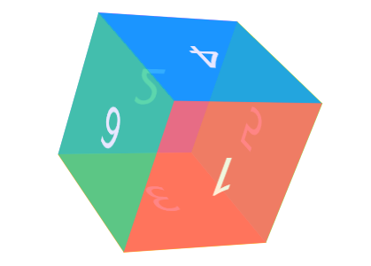

#### 自适应相册

自适应照片数量的相册九宫格相册、微信相册、图集
```css
<div class="bruce flex-ct-x">
	<ul class="response-album">
		<li class="item"></li>
		<li class="item"></li>
		<li class="item"></li>
		<li class="item"></li>
		<li class="item"></li>
		<li class="item"></li>
		<li class="item"></li>
		<li class="item"></li>
		<li class="item"></li>
	</ul>
</div>
@mixin square($count: 2) {
	$length: calc((100% - #{$count} * 10px) / #{$count});
	width: $length;
	height: $length;
}
.response-album {
	display: flex;
	flex-wrap: wrap;
	justify-content: flex-start;
	align-content: flex-start;
	padding: 5px;
	border: 1px solid #ccc;
	border-radius: 5px;
	width: 400px;
	height: 400px;
	li {
		display: flex;
		overflow: hidden;
		justify-content: center;
		margin: 5px;
		background-color: #f0f0f0;
		@include square(3);
	}
	img {
		width: 100%;
		height: 100%;

		object-fit: cover;
	}
}
// 一个元素
.item:only-child {
	border-radius: 10px;
	width: auto;
	max-width: 80%;
	height: auto;
	max-height: 80%;
}
// 两个元素
.item:first-child:nth-last-child(2),
.item:first-child:nth-last-child(2) ~ .item:nth-child(2) {
	@include square(2);
}
.item:first-child:nth-last-child(2) {
	border-radius: 10px 0 0 10px;
}
.item:first-child:nth-last-child(2) ~ .item:nth-child(2) {
	border-radius: 0 10px 10px 0;
}
// 三个元素
.item:first-child:nth-last-child(3),
.item:first-child:nth-last-child(3) ~ .item:nth-child(2),
.item:first-child:nth-last-child(3) ~ .item:nth-child(3) {
	@include square(2);
}
.item:first-child:nth-last-child(3) {
	border-top-left-radius: 10px;
}
.item:first-child:nth-last-child(3) ~ .item:nth-child(2) {
	border-top-right-radius: 10px;
}
.item:first-child:nth-last-child(3) ~ .item:nth-child(3) {
	border-bottom-left-radius: 10px;
}
// 四个元素
.item:first-child:nth-last-child(4),
.item:first-child:nth-last-child(4) ~ .item:nth-child(2),
.item:first-child:nth-last-child(4) ~ .item:nth-child(3),
.item:first-child:nth-last-child(4) ~ .item:nth-child(4) {
	@include square(2);
}
.item:first-child:nth-last-child(4) {
	border-top-left-radius: 10px;
}
.item:first-child:nth-last-child(4) ~ .item:nth-child(2) {
	border-top-right-radius: 10px;
}
.item:first-child:nth-last-child(4) ~ .item:nth-child(3) {
	border-bottom-left-radius: 10px;
}
.item:first-child:nth-last-child(4) ~ .item:nth-child(4) {
	border-bottom-right-radius: 10px;
}
// 五个元素
.item:first-child:nth-last-child(5) {
	border-top-left-radius: 10px;
}
.item:first-child:nth-last-child(5) ~ .item:nth-child(3) {
	border-top-right-radius: 10px;
}
.item:first-child:nth-last-child(5) ~ .item:nth-child(4) {
	border-bottom-left-radius: 10px;
}
// 六个元素
.item:first-child:nth-last-child(6) {
	border-top-left-radius: 10px;
}
.item:first-child:nth-last-child(6) ~ .item:nth-child(3) {
	border-top-right-radius: 10px;
}
.item:first-child:nth-last-child(6) ~ .item:nth-child(4) {
	border-bottom-left-radius: 10px;
}
.item:first-child:nth-last-child(6) ~ .item:nth-child(6) {
	border-bottom-right-radius: 10px;
}
// 七个元素
.item:first-child:nth-last-child(7) {
	border-top-left-radius: 10px;
}
.item:first-child:nth-last-child(7) ~ .item:nth-child(3) {
	border-top-right-radius: 10px;
}
.item:first-child:nth-last-child(7) ~ .item:nth-child(7) {
	border-bottom-left-radius: 10px;
}
// 八个元素
.item:first-child:nth-last-child(8) {
	border-top-left-radius: 10px;
}
.item:first-child:nth-last-child(8) ~ .item:nth-child(3) {
	border-top-right-radius: 10px;
}
.item:first-child:nth-last-child(8) ~ .item:nth-child(7) {
	border-bottom-left-radius: 10px;
}
// 九个元素
.item:first-child:nth-last-child(9) {
	border-top-left-radius: 10px;
}
.item:first-child:nth-last-child(9) ~ .item:nth-child(3) {
	border-top-right-radius: 10px;
}
.item:first-child:nth-last-child(9) ~ .item:nth-child(7) {
	border-bottom-left-radius: 10px;
}
.item:first-child:nth-last-child(9) ~ .item:nth-child(9) {
	border-bottom-right-radius: 10px;
}
```
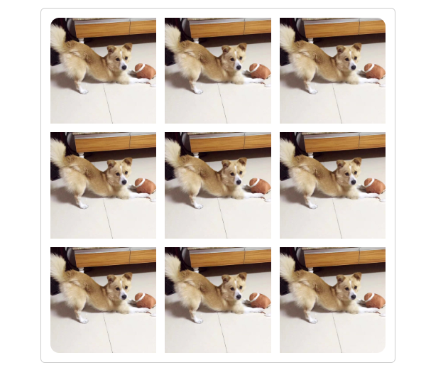

#### 圆角进度条

单一颜色的圆角进度条
```css
<div class="bruce flex-ct-x">
	<div class="fillet-progressbar"></div>
</div>

@mixin progress-bar($width: 100px, $height: 10px, $color: $red, $percent: 0) {
	border-radius: $height / 2;
	width: $width;
	height: $height;
	background-color: #ccc;
	background-image: radial-gradient(closest-side circle at $percent, $color, $color 100%, transparent),
		linear-gradient($color, $color);
	background-repeat: no-repeat;
	background-size: 100%, $percent;
}
.fillet-progressbar {
	@include progress-bar(500px, 10px, $purple, 50%);
}
```
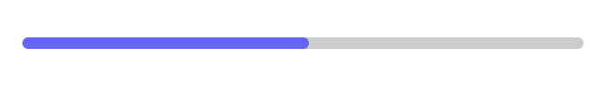