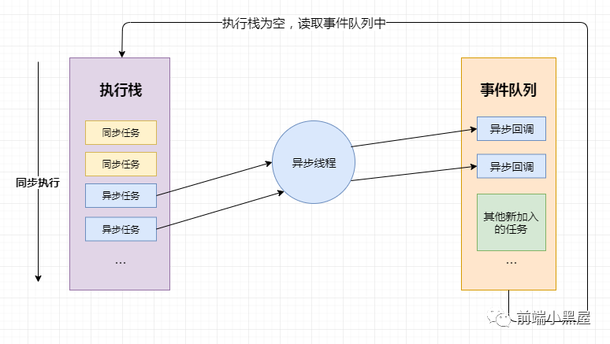
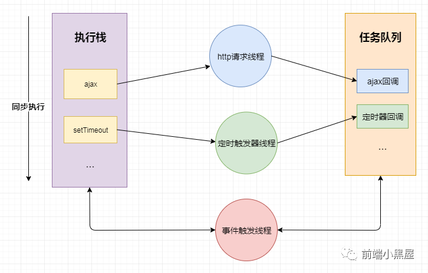
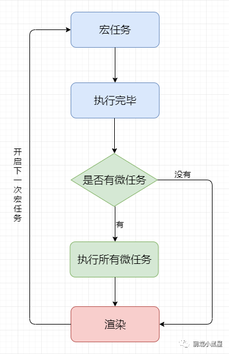

<!--
 * @Description: In User Settings Edit
 * @Author: wginit
 * @Date: 2019-09-26 09:29:33
 * @LastEditTime: 2019-09-26 10:19:04
 -->

# Event Loop

几乎在每一本JS相关的书籍中，都会说JS是 单线程的，JS是通过事件队列 (EventLoop)的方式来实现异步回调的。对很多初学JS的人来说，根本搞不清楚单线程的JS为什么拥有 异步的能力，所以，我试图从 进程、 线程的角度来解释这个问题。

## CPU

计算机的核心是 CPU，它承担了所有的计算任务。它就像一座工厂，时刻在运行。

## 进程

工厂的电力有限，一次只能供给一个车间使用。也就是说，一个车间开工的时候，其他车间都必须停工。背后的含义就是，单个CPU一次只能运行一个任务。

进程就好比工厂的车间，它代表CPU所能处理的单个任务。进程之间相互独立，任一时刻，CPU总是运行一个 进程，其他 进程处于非运行状态。CPU使用时间片轮转进度算法来实现同时运行多个 进程。

## 线程

每个车间里，可以有很多工人，共享车间所有的资源，他们协同完成一个任务。

线程就好比车间里的工人，一个 进程可以包括多个 线程，多个 线程共享 进程资源。

## CPU、进程、线程之间的关系

从上文我们已经简单了解了CPU、进程、线程，简单汇总一下。

* 进程是cpu资源分配的最小单位（是能拥有资源和独立运行的最小单位）
* 线程是cpu调度的最小单位（线程是建立在进程的基础上的一次程序运行* 单位，一个进程中可以有多个线程）
* 不同 进程之间也可以通信，不过代价较大
* 单线程与 多线程，都是指在一个 进程内的单和多

## 浏览器是多进程的

我们已经知道了 CPU、 进程、 线程之间的关系，对于计算机来说，每一个应用程序都是一个 进程， 而每一个应用程序都会分别有很多的功能模块，这些功能模块实际上是通过 子进程来实现的。对于这种 子进程的扩展方式，我们可以称这个应用程序是 多进程的。而对于浏览器来说，浏览器就是多进程的。

总结一下：

* 浏览器是多进程的
* 每一个Tab页，就是一个独立的进程

## 浏览器包含了哪些进程

### 主进程

* 协调控制其他子进程（创建、销毁）
* 浏览器界面显示，用户交互，前进、后退、收藏
* 将渲染进程得到的内存中的Bitmap，绘制到用户界面上
* 处理不可见操作，网络请求，文件访问等

### 第三方插件进程

* 每种类型的插件对应一个进程，仅当使用该插件时才创建

### GPU进程

* 用于3D绘制等
* 渲染进程，就是我们说的 浏览器内核
* 负责页面渲染，脚本执行，事件处理等
* 每个tab页一个渲染进程

那么浏览器中包含了这么多的进程，那么对于普通的前端操作来说，最重要的是什么呢？
答案是 渲染进程，也就是我们常说的 浏览器内核

## 浏览器内核（渲染进程）

从前文我们得知，进程和线程是一对多的关系，也就是说一个进程包含了多条线程。

而对于 渲染进程来说，它当然也是多线程的了，接下来我们来看一下渲染进程包含哪些线程。

### GUI渲染线程

* 负责渲染页面，布局和绘制
* 页面需要重绘和回流时，该线程就会执行
* 与js引擎线程互斥，防止渲染结果不可预期

### JS引擎线程

* 负责处理解析和执行javascript脚本程序
* 只有一个JS引擎线程（单线程）
* 与GUI渲染线程互斥，防止渲染结果不可预期

### 事件触发线程

* 用来控制事件循环（鼠标点击、setTimeout、ajax等）
* 当事件满足触发条件时，将事件放入到JS引擎所在的执行队列中

### 定时触发器线程

* setInterval与setTimeout所在的线程
* 定时任务并不是由JS引擎计时的，是由定时触发线程来计时的
* 计时完毕后，通知事件触发线程

### 异步http请求线程

* 浏览器有一个单独的线程用于处理AJAX请求
* 当请求完成时，若有回调函数，通知事件触发线程

当我们了解了渲染进程包含的这些线程后，我们思考两个问题：

为什么 javascript 是单线程的
为什么 GUI 渲染线程与 JS 引擎线程互斥


## 为什么 javascript 是单线程的

首先是历史原因，在创建 javascript 这门语言时，多进程多线程的架构并不流行，硬件支持并不好。

其次是因为多线程的复杂性，多线程操作需要加锁，编码的复杂性会增高。

而且，如果同时操作 DOM ，在多线程不加锁的情况下，最终会导致 DOM 渲染的结果不可预期。

## 为什么 GUI 渲染线程为什么与 JS 引擎线程互斥

这是由于 JS 是可以操作 DOM 的，如果同时修改元素属性并同时渲染界面(即 JS线程和 UI线程同时运行)， 那么渲染线程前后获得的元素就可能不一致了。

因此，为了防止渲染出现不可预期的结果，浏览器设定 GUI渲染线程和 JS引擎线程为互斥关系， 当 JS引擎线程执行时 GUI渲染线程会被挂起，GUI更新则会被保存在一个队列中等待 JS引擎线程空闲时立即被执行。

## 从 Event Loop 看 JS 的运行机制

到了这里，终于要进入我们的主题，什么是 Event Loop

### 先理解一些概念：

* JS 分为同步任务和异步任务
* 同步任务都在JS引擎线程上执行，形成一个 执行栈
* 事件触发线程管理一个 任务队列，异步任务触发条件达成，将回调事件放到 任务队列中
* 执行栈中所有同步任务执行完毕，此时JS引擎线程空闲，系统会读取 任务队列，将可运行的异步任务回调事件添加到 执行栈中，开始执行



前端开发中我们会通过 setTimeout/setInterval来指定定时任务，会通过 XHR/fetch发送网络请求， 接下来简述一下 setTimeout/setInterval和 XHR/fetch到底做了什么事

我们知道，不管是 setTimeout/setInterval和 XHR/fetch代码，在这些代码执行时， 本身是同步任务，而其中的回调函数才是异步任务。

当代码执行到 setTimeout/setInterval时，实际上是 JS引擎线程通知 定时触发器线程，间隔一个时间后，会触发一个回调事件， 而 定时触发器线程在接收到这个消息后，会在等待的时间后，将回调事件放入到由 事件触发线程所管理的 事件队列中。

当代码执行到 XHR/fetch时，实际上是 JS引擎线程通知 异步http请求线程，发送一个网络请求，并制定请求完成后的回调事件， 而 异步http请求线程在接收到这个消息后，会在请求成功后，将回调事件放入到由 事件触发线程所管理的 事件队列中。

当我们的同步任务执行完， JS引擎线程会询问 事件触发线程，在 事件队列中是否有待执行的回调函数，如果有就会加入到执行栈中交给 JS引擎线程执行

用一张图来解释：



用代码来解释一下：

```javascript
let timerCallback = function(){
  console.log('wait one second');
};
let httpCallback = function() {
  console.log('get server data success');
}

// 同步任务
console.log('hello');
// 同步任务
// 通知定时器线程 1s 后将 timerCallback 交由事件触发线程处理
// 1s 后事件触发线程将 timerCallback 加入到事件队列中
setTimeout(timerCallback, 1000);
// 同步任务
// 通知异步http请求线程发送网络请求，请求成功后将 httpCallback 交由事件触发线程处理
// 请求成功后事件触发线程将 httpCallback 加入到事件队列中
$.get('www.xxxx.com', httpCallback);
// 同步任务
console.log('world');
//...
// 所有同步任务执行完后
// 询问事件触发线程在事件事件队列中是否有需要执行的回调函数
// 如果没有，一直询问，直到有为止
// 如果有，将回调事件加入执行栈中，开始执行回调代码
```

> 总结一下：

* JS引擎线程只执行执行栈中的事件
* 执行栈中的代码执行完毕，就会读取事件队列中的事件
* 事件队列中的回调事件，是由各自线程插入到事件队列中的
* 如此循环

## 宏任务、微任务

当我们基本了解了什么是执行栈，什么是事件队列之后，我们深入了解一下事件循环中 宏任务、 微任务

### 什么是宏任务
我们可以将每次执行栈执行的代码当做是一个宏任务（包括每次从事件队列中获取一个事件回调并放到执行栈中执行）， 每一个宏任务会从头到尾执行完毕，不会执行其他。

我们前文提到过 JS引擎线程和 GUI渲染线程是互斥的关系，浏览器为了能够使 宏任务和 DOM任务有序的进行，会在一个 宏任务执行结果后，在下一个 宏任务执行前， GUI渲染线程开始工作，对页面进行渲染。

```javascript
// 宏任务-->渲染-->宏任务-->渲染-->渲染．．．
```

主代码块，setTimeout，setInterval等，都属于宏任务

### 什么是微任务
我们已经知道 宏任务结束后，会执行渲染，然后执行下一个 宏任务， 而微任务可以理解成在当前 宏任务执行后立即执行的任务。

也就是说，当 宏任务执行完，会在渲染前，将执行期间所产生的所有 微任务都执行完。

Promise，process.nextTick等，属于 微任务

```javascript
setTimeout(()=>{
    console.log(1)
    Promise.resolve(3).then(data =>console.log(data))
},0)

setTimeout(()=>{
    console.log(2)
},0)

// print : 1 3 2
```

上面代码共包含两个 setTimeout ，也就是说除主代码块外，共有两个 宏任务， 其中第一个 宏任务执行中，输出 1 ，并且创建了 微任务队列，所以在下一个 宏任务队列执行前， 先执行 微任务，在 微任务执行中，输出 3 ，微任务执行后，执行下一次 宏任务，执行中输出 2

## 总结

* 执行一个 宏任务（栈中没有就从 事件队列中获取）
* 执行过程中如果遇到 微任务，就将它添加到 微任务的任务队列中
* 宏任务执行完毕后，立即执行当前 微任务队列中的所有 微任务（依次执行）
* 当前 宏任务执行完毕，开始检查渲染，然后 GUI线程接管渲染
* 渲染完毕后， JS线程继续接管，开始下一个 宏任务（从事件队列中获取）


